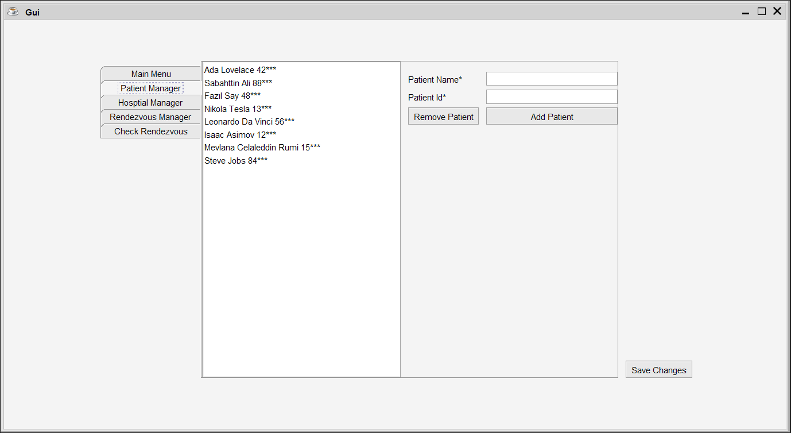
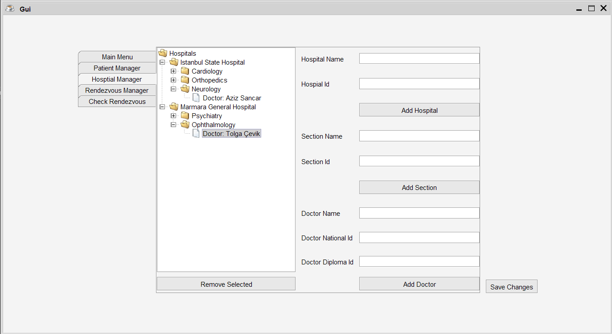
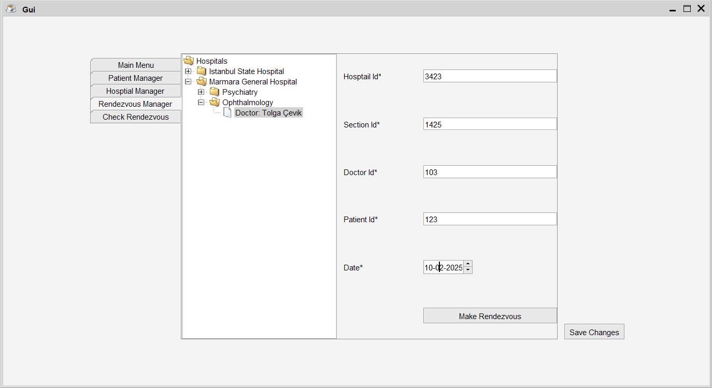

# Healthcare Appointment Management System

## Overview

This Java application is a comprehensive Clinic Reservation System (CRS) that provides a graphical user interface for managing hospital, patient, doctor, and appointment information. The system allows users to:

- Add and remove patients
- Manage hospitals, sections, and doctors
- Create and manage medical appointments (rendezvous)
- Persist data between sessions

## Features

### Patient Management
- Add new patients with unique IDs
- Remove existing patients
- View a list of all patients



### Hospital , Section and Doctor Management
- Add hospitals , sections and doctors 
- Organize hospitals with multiple sections
- View hospital hierarchy in a tree structure




### Appointment (Rendezvous) Management
- Create appointments for patients
- Select hospital, section, and doctor
- Choose appointment date



## Technology Stack

- Java Swing for GUI
- JTattoo Look and Feel
- Serialization for data persistence
- JUnit for testing

## Prerequisites

- Java Development Kit (JDK) 8 or higher
- Maven or Gradle (recommended for dependency management)
- JUnit for running tests

## Installation

1. Clone the repository:
```bash
git clone https://github.com/hubble658/Hospital-Administrator-System.git
```

2. Navigate to the project directory:
```bash
cd Hospital-Administrator-System
```

3. Compile the project (using Maven or Gradle)
4. Run the main application

## Running the Application

```bash
java -jar Application.jar
```

## Key Components

- `Gui.java`: Main graphical user interface
- `CRS.java`: Core reservation system logic
- `Patient.java`: Patient data model
- `Hospital.java`: Hospital data model
- `Section.java`: Hospital section data model
- `Doctor.java`: Doctor data model
- `Rendezvous.java`: Appointment data model


The application uses Java serialization to save and load application data. Data is stored in `data.ser` file.


## License

Distributed under the MIT License. See `LICENSE` for more information.

